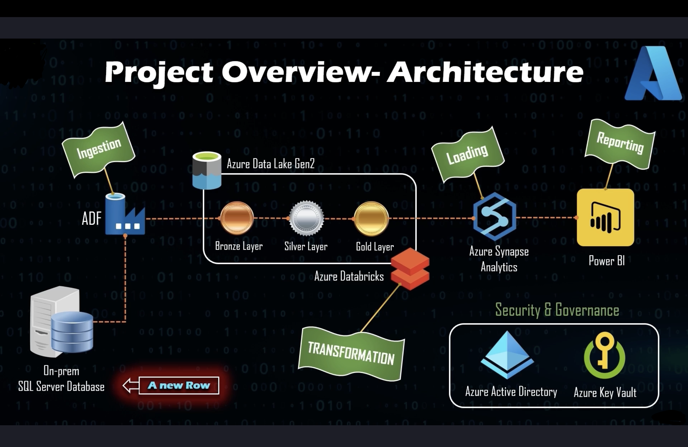
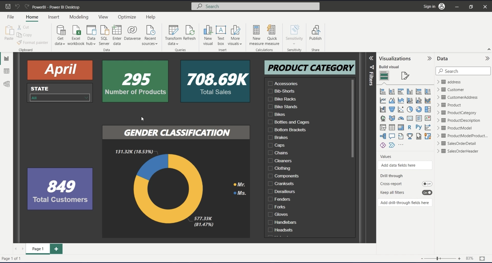

# End-to-End Azure Data Engineering Project with AdventureWorks

## Overview
This repository contains a comprehensive end-to-end Azure Data Engineering project that demonstrates the full lifecycle of a modern data pipeline using Microsoft Azure services. The project leverages the AdventureWorks dataset to perform data ingestion, storage, transformation, loading, reporting, and end-to-end pipeline testing. Additionally, it incorporates security and governance best practices using Microsoft Entra ID. 

### Tools and Technologies Used
- **Azure Data Factory (ADF)**: For data ingestion and pipeline orchestration.
- **Azure Data Lake Storage Gen2 (ADLS Gen2)**: For storing data in Bronze, Silver, and Gold layers.
- **Azure Databricks**: For data transformation (Bronze to Silver, Silver to Gold).
- **Azure Synapse Analytics**: For data loading and creating a serverless SQL database (`gold_db`).
- **Power BI**: For data reporting and visualization (`SalesAnalysis.pbix`).
- **Microsoft Entra ID**: For security and governance (security group setup).
- **Azure Key Vault**: For securely storing credentials.
- **Azure Virtual Machines (VMs)**: For running Windows-based tools (e.g., Power BI Desktop, Self-hosted Integration Runtime).

### Project Architecture
The project follows a Lakehouse architecture with the following flow:
1. **Data Source**: AdventureWorks dataset (originally hosted on an on-premises SQL Server, simulated in the Bronze layer for this project).
2. **Data Ingestion**: ADF ingests data into the Bronze layer in ADLS Gen2.
3. **Data Storage**: Data is stored in ADLS Gen2 (`adlsmrktalkstech`) in Bronze (`bronze/SalesLT/`), Silver (`silver/SalesLT/`), and Gold (`gold/SalesLT/`) layers.
4. **Data Transformation**: Databricks transforms data from Bronze to Silver (cleaning) and Silver to Gold (final transformations, e.g., renaming columns).
5. **Data Loading**: Synapse Analytics loads Gold layer data into a serverless SQL database (`gold_db`) and creates views.
6. **Data Reporting**: Power BI connects to `gold_db` and creates a report (`SalesAnalysis.pbix`).
7. **Pipeline Testing**: The pipeline is automated and tested with new data to ensure end-to-end functionality.
8. **Security and Governance**: MicrosoftEntraID is used to create a security group for access management.


### Project Parts

#### Part 1: Environment Setup
- **Objective**: Set up the Azure environment and prepare the data source.
- **Steps**:
  - Created a resource group (`rg-mrk-talks-tech-data-eng`) in East US 2.
  - Created Azure resources: ADF, ADLS Gen2 (`adlsmrktalkstech`), Databricks (`udaya-kotian-cluster-2`), Synapse Analytics (`syn-mrk-talks-tech`), and Key Vault.
  - Set up the AdventureWorks database using SQL Server Management Studio (SSMS) by following the Microsoft guide: [AdventureWorks Installation](https://learn.microsoft.com/en-us/sql/samples/adventureworks-install-configure?view=sql-server-ver16&tabs=ssms).
  - Created a login (`MrK`) and user for the AdventureWorks database with the `db_datareader` role using the script `create_login.sql`:
    ```sql
    USE AdventureWorksLT2017
    GO
    CREATE LOGIN MrK WITH #### = '####';
    GO
    CREATE USER MrK FOR LOGIN MrK;
    GO
    ALTER ROLE db_datareader ADD MEMBER MrK;
    GO
    ```
  - Stored the credentials in Azure Key Vault as secrets (`username: MrK`, `####`).
- **Outcome**: Environment setup completed with all necessary Azure resources and data source prepared.

#### Part 2: Data Ingestion
- **Objective**: Ingest AdventureWorks data into the Bronze layer using ADF.
- **Steps**:
  - Installed a Self-hosted Integration Runtime (SHIR) named `SHIR` on a VM (`sqlvm-mrk-talks-tech`, Windows Server 2019, 2 vCPUs) to connect ADF to the on-premises SQL Server.
  - Created an ADF pipeline (`CopyAdventureWorksToBronze`) with:
    - **Lookup Activity**: Retrieved the list of tables (e.g., `SalesLT.Address`, `SalesLT.Customer`).
    - **ForEach Activity**: Iterated over the tables.
    - **Copy Activity**: Copied each table to `bronze/SalesLT/<table_name>/` in Delta format.
  - Configured linked services for the SQL Server (using Key Vault for credentials) and ADLS Gen2.
- **Outcome**: Successfully ingested tables (`Address`, `Customer`, `SalesOrderHeader`, `SalesOrderDetail`, `Product`, `ProductCategory`, etc.) into the Bronze layer.
- **Challenges**: None encountered in this part.

#### Part 3: Data Transformation
- **Objective**: Transform data from Bronze to Silver (cleaning) and Silver to Gold (final transformations) using Databricks.
- **Steps**:
  - Set up a Databricks cluster (`udaya-kotian-cluster-2`, 4 vCPUs, 14 GB RAM).
  - Created two notebooks:
    - `bronze_to_silver.py`: Cleaned data (e.g., date formatting for `OrderDate`).
    - `silver_to_gold.py`: Renamed columns (e.g., `SalesOrderID` to `Sales_Order_ID`).
  - Updated the ADF pipeline to include:
    - **bronze to silver Notebook Activity**: Ran the `bronze_to_silver` notebook.
    - **silver to gold Notebook Activity**: Ran the `silver_to_gold` notebook.
  - Output paths:
    - Silver: `silver/SalesLT/`.
    - Gold: `gold/SalesLT/`.
- **Challenges and Resolutions**:
  - **SHIR Offline Error**: The pipeline failed with "The Self-hosted Integration Runtime 'SHIR' is offline." The VM was powered off, causing the SHIR to disconnect. Resolved by powering on the VM, restarting the SHIR service, and verifying connectivity.
  - **Databricks Cluster Stopped**: The cluster stopped due to vCPU quota limits (VM: 2 vCPUs, cluster: 4 vCPUs). Resolved by restarting the cluster and rerunning the pipeline.
  - **Multiple Files in Silver Layer**: Multiple files appeared in `silver/SalesLT/` due to repeated pipeline runs with `.mode("overwrite")`. Suggested using `VACUUM` and `OPTIMIZE` to clean up and compact files, but this was optional and skipped.
- **Outcome**: Data was transformed and stored in the Silver and Gold layers. Transformations (e.g., column renaming) were verified in Part 6.

#### Part 4: Data Loading
- **Objective**: Load Gold layer data into Azure Synapse Analytics and create views.
- **Steps**:
  - Granted the Synapse workspace (`syn-mrk-talks-tech`) the `Storage Blob Data Contributor` role on `adlsmrktalkstech`.
  - Created a serverless SQL database (`gold_db`) in Synapse Studio.
  - Created a stored procedure (`CreateSQLServerlessView_gold`) to dynamically create views:
    ```sql
    USE gold_db
    GO
    CREATE OR ALTER PROC CreateSQLServerlessView_gold @ViewName nvarchar(100)
    AS
    BEGIN
        DECLARE @statement VARCHAR(MAX)
        SET @statement = N'CREATE OR ALTER VIEW ' + @ViewName + ' AS
            SELECT * 
            FROM 
                OPENROWSET(
                    BULK ''https://adlsmrktalkstech.dfs.core.windows.net/gold/SalesLT/' + @ViewName + '/'',
                    FORMAT = ''DELTA''
                ) as [result]'
        EXEC (@statement)
    END
    GO
    ```
  - Created a pipeline (`create_view`) in Synapse Studio to:
    - Use a `Get Metadata` activity to retrieve table names from `gold/SalesLT/`.
    - Use a `ForEach` activity to iterate over table names.
    - Call the stored procedure for each table to create views.
  - Ran the pipeline and verified views in `gold_db` (e.g., `Address`, `Customer`, `SalesOrderHeader`).
- **Outcome**: All views were created in `gold_db`, and data was accessible for reporting.
- **Challenges**: None encountered.

#### Part 5: Data Reporting
- **Objective**: Create a Power BI report (`SalesAnalysis.pbix`) with visuals like Total Customers and Sales by Product Category.
- **Initial Attempt: Power BI Desktop on Existing VM**:
  - **VM Setup**: Used `sqlvm-mrk-talks-tech` (Windows Server 2019, 2 vCPUs).
  - **Issues**:
    - Crashes with `SqlDumper.exe` errors (`0xc000012d`, `0xc0000142`).
    - `WindowManager.ShowModal` error: "Cannot enter the re-entrancy monitor for 'WindowManager.ShowModal'."
    - "External component has thrown an exception" error.
    - Network issues prevented downloading the 64-bit installer; 32-bit version also failed.
  - **Diagnosis**: Compatibility issues with Windows Server 2019, SQL Server 2022, and Power BI Desktop.
  - **Decision**: Abandoned this VM due to persistent issues.
- **Fallback Attempt: Power BI Service**:
  - Tried creating the report in Power BI Service (https://app.powerbi.com) from the Mac.
  - Connected to `gold_db` using the Azure Synapse Analytics (SQL DW) connector.
  - Issue: Export to `.pbix` required a Power BI Pro license (not available in the free tier), and it “didn’t work.”
  - Decision: Shifted back to Power BI Desktop with a new VM.
- **New VM Setup: Windows 10 Pro**:
  - Stopped `sqlvm-mrk-talks-tech` and Databricks cluster to free vCPUs.
  - Created a new VM:
    - Name: `win10-mrk-talks-tech`.
    - Image: Windows 10 Pro - x64 Gen2.
    - Size: Standard_B2s (2 vCPUs, 4 GB RAM).
    - Username: `adminuser`.
    - ####: `P@ssw0rd123!`.
  - **Challenges**:
    - Spending limit error: Resolved by removing the spending limit in Azure Account Center.
    - VM size/region error: Used Standard_B2s after trying smaller sizes.
    - Image availability: Windows 11 Pro wasn’t available; used Windows 10 Pro.
  - Installed dependencies:
    - Visual C++ Redistributable: `vc_redist.x64.exe`.
    - Microsoft OLE DB Driver: `msoledbsql.msi`.
    - .NET Framework 4.8 Runtime: `ndp48-x86-x64-allos-enu.exe`.
  - Installed Power BI Desktop: `PBIDesktopSetup_x64.exe`.
- **Power BI Desktop Issues**:
  - **WindowManager.ShowModal**: Fixed by using the Azure Synapse Analytics (SQL DW) connector and clearing cache.
  - **"External component has thrown an exception"**: Fixed by installing .NET Framework 4.8 and reinstalling Power BI Desktop.
- **Create the Report**:
  - Connected to `gold_db` using DirectQuery mode.
  - Loaded views: `Address`, `Customer`, `SalesOrderHeader`, `SalesOrderDetail`, `Product`, `ProductCategory`.
  - Set relationships (e.g., `Customer_ID`, `Sales_Order_ID`).
  - Created visuals:
    - **Total Customers**: Card with 849 customers.
    - **Sales by Product Category**: Clustered Column Chart.
    - **Additional Visuals**: Number of Products (295), Total Sales (708.69K), Gender Classification (Mr.: 81.47%, Ms.: 18.53%), State filter, Product Category slicer.
  - Saved as: `SalesAnalysis.pbix`.


- **Outcome**: Part 5 completed with an enhanced report exceeding the minimum requirements.

#### Security and Governance Setup
- **Objective**: Implement security best practices using Microsoft Entra ID.
- **Steps**:
  - Created a security group (`DataEngineerGroup`) in AAD.
  - Set `udaya.ko@...` as the owner and member (no secondary account available).
  - Assigned the Contributor role to `DataEngineerGroup` for `rg-mrk-talks-tech-data-eng`.
  - Skipped testing with a secondary account due to lack of one.
- **Outcome**: Security group setup completed, aligning with real-time project best practices.

#### Part 6: End-to-End Pipeline Testing
- **Objective**: Automate the pipeline, add new data, and verify updates in Power BI.
- **Steps**:
  - **Create Scheduled Trigger**:
    - In ADF, created `Scheduled_Trigger`:
      - Type: Schedule.
      - Recurrence: Every 1 day.
      - Time: Set to 15 minutes from the current time.
      - Time Zone: India Standard Time (UTC+05:30).
    - Published the trigger.
  - **Add New Data**:
    - Modified the `Customer` table:
      - Downloaded `Customer` from `bronze/SalesLT/`.
      - Added 2 rows: `CustomerID` 30119 (“John Doe”) and 30120 (“Jane Smith”).
      - Uploaded as `Customer_new.csv` to `bronze/SalesLT/`.
  - **Run the Pipeline**:
    - Waited for the scheduled trigger to run the pipeline.
    - Monitored in ADF > Monitor tab; confirmed the pipeline ran successfully.
    - Verified data flow:
      - Bronze: `Customer_new.csv` in `bronze/SalesLT/`.
      - Silver: Cleaned data in `silver/SalesLT/`.
      - Gold: Transformed data in `gold/SalesLT/` (verified `CustomerID` renamed to `Customer_ID`).
      - Synapse: `gold_db` (confirmed 2 new rows in `Customer` view).
  - **Refresh Power BI Report**:
    - Opened `SalesAnalysis.pbix`.
    - Clicked **Refresh**.
    - Confirmed Total Customers updated from 849 to 851.
  - **Verify End-to-End Flow**:
    - The pipeline successfully processed the new data through all layers, and the Power BI report reflected the updates.
- **Outcome**: Part 6 completed, confirming the pipeline works end-to-end.

### Additional Tasks Addressed
- **Verify Gold Layer Transformations** (Pending from Part 3):
  - Verified during Part 6 that `SalesOrderID` was renamed to `Sales_Order_ID` and `CustomerID` to `Customer_ID` in the Gold layer and `gold_db` views.
- **Silver Layer Optimization**:
  - Skipped the optional `VACUUM`/`OPTIMIZE` step for the Silver layer, as the pipeline worked fine without it.
- **Secondary Account Testing for Security Group**:
  - Skipped due to lack of a secondary account; not critical for project completion.

### Key Deliverables
- **Pipeline**: Automated ADF pipeline (`CopyAdventureWorksToBronze` and `LoadGoldToSynapse`) with a scheduled trigger (`Scheduled_Trigger`).
- **Data Layers**:
  - Bronze: `bronze/SalesLT/` in `adlsmrktalkstech`.
  - Silver: `silver/SalesLT/`.
  - Gold: `gold/SalesLT/`.
- **Synapse Database**: `gold_db` in `syn-mrk-talks-tech` with views for all tables.
- **Power BI Report**: `SalesAnalysis.pbix` with visuals:
  - Total Customers: 851 (after adding new data).
  - Sales by Product Category.
  - Additional visuals: Number of Products, Total Sales, Gender Classification, State filter, Product Category slicer.
- **Security**: `DataEngineerGroup` in AAD with Contributor access to `rg-mrk-talks-tech-data-eng`.
